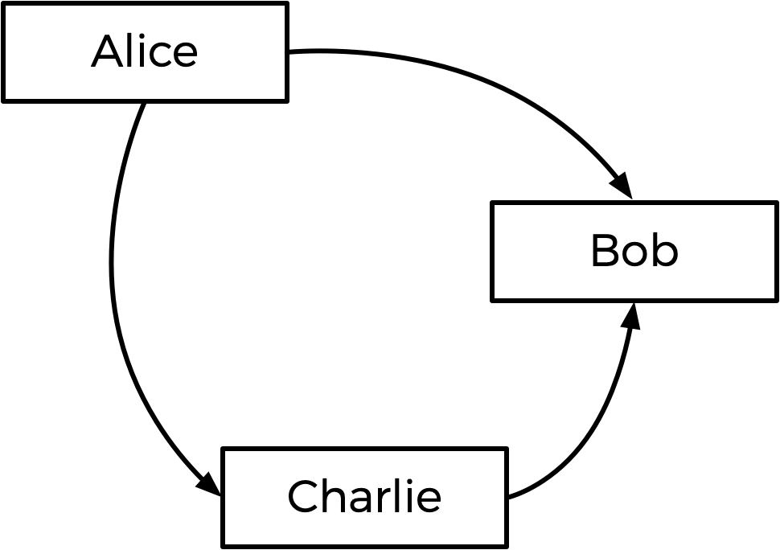
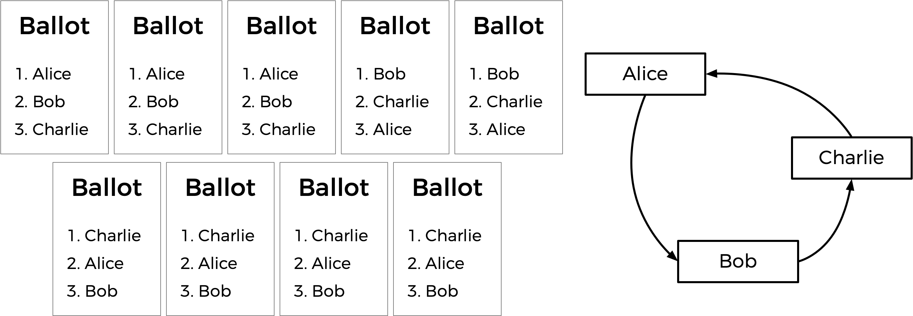
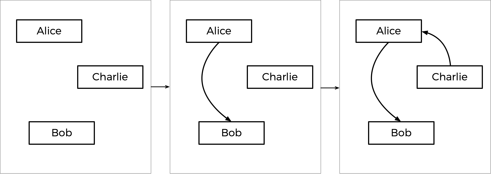

## Week3 Problem Sets
### Sort
Some algorithms for sorting a sequence of numbers include: selection sort, bubble sort, and merge sort.

- Selection sort iterates through the unsorted portions of a list, selecting the smallest element each time and 
moving it to its correct location.
- Bubble sort compares pairs of adjacent values one at a time and swaps them if they are in the incorrect order. This 
continues until the list is sorted.
- Merge sort recursively divides the list into two repeatedly and then merges the smaller lists back into a larger one 
in the correct order.

In this problem, you’ll analyze three (compiled!) sorting programs to determine which algorithms they use.

For this problem, you’ll need some “distribution code”. Provided to you are three already-compiled C programs, 
sort1, sort2, and sort3, as well as several .txt files for input. Each of sort1, sort2, and sort3 implements a 
different sorting algorithm: selection sort, bubble sort, or merge sort (though not necessarily in that order!). Your 
task is to determine which sorting algorithm is used by each file. Write a function that returns the answer.

The files are found in sort_problems_files:
1. random5000.txt
2. random10000.txt
3. random50000.txt
4. reversed5000.txt
5. reversed10000.txt
6. reversed50000.txt
7. sorted5000.txt
8. sorted10000.txt
9. sorted50000.txt

### Plurality
Elections come in all shapes and sizes. In the UK, the Prime Minister is officially appointed by the monarch, who 
generally chooses the leader of the political party that wins the most seats in the House of Commons. The United States
uses a multi-step Electoral College process where citizens vote on how each state should allocate Electors who then 
elect the President.

Perhaps the simplest way to hold an election, though, is via a method commonly known as the “plurality vote” (also 
known as “first-past-the-post” or “winner take all”). In the plurality vote, every voter gets to vote for one candidate. 
At the end of the election, whichever candidate has the greatest number of votes is declared the winner of the election.

For this problem, you’ll implement a program that runs a plurality election.

#### Specification
1. The program can accommodate a maximum of 9 candidates.
2. No duplicate candidates should exist.
3. Voting is done by name.
4. Invalidate any votes that don't match a candidates name (throw the vote away),
5. Return the winner(s) of the election (can have multiple winners).

### Runoff
You already know about plurality elections, which follow a very simple algorithm for determining the winner of an 
election: every voter gets one vote, and the candidate with the most votes wins.

But the plurality vote does have some disadvantages. What happens, for instance, in an election with three candidates, 
and the ballots below are cast?

| Ballot | Ballot | Ballot | Ballot | Ballot  |
|--------|--------|--------|--------|---------|
| Alice  | Alice  | Bob    | Bob    | Charlie |

A plurality vote would here declare a tie between Alice and Bob, since each has two votes. But is that the right 
outcome?

There’s another kind of voting system known as a ranked-choice voting system. In a ranked-choice system, voters can 
vote for more than one candidate. Instead of just voting for their top choice, they can rank the candidates in order 
of preference. The resulting ballots might therefore look like the below.

|   | Ballot  | Ballot  | Ballot  | Ballot  | Ballot  |
|---|---------|---------|---------|---------|---------|
| 1 | Alice   | Alice   | Bob     | Bob     | Charlie |
| 2 | Bob     | Charlie | Alice   | Alice   | Alice   |
| 3 | Charlie | Bob     | Charlie | Charlie | Bob     |

Here, each voter, in addition to specifying their first preference candidate, has also indicated their second and 
third choices. And now, what was previously a tied election could now have a winner. The race was originally tied 
between Alice and Bob, so Charlie was out of the running. But the voter who chose Charlie preferred Alice to Bob, so 
Alice could here be declared the winner.

Ranked choice voting can also solve yet another potential drawback of plurality voting. Take a look at the following ballots.

|   | Ballot  | Ballot  | Ballot  | Ballot  | Ballot  | Ballot  | Ballot  | Ballot  | Ballot  |
|---|---------|---------|---------|---------|---------|---------|---------|---------|---------|
| 1 | Alice   | Alice   | Bob     | Bob     | Bob     | Charlie | Charlie | Charlie | Charlie |
| 2 | Bob     | Bob     | Alice   | Alice   | Alice   | Alice   | Alice   | Bob     | Bob     |
| 3 | Charlie | Charlie | Charlie | Charlie | Charlie | Bob     | Bob     | Alice   | Alice   |

Who should win this election? In a plurality vote where each voter chooses their first preference only, Charlie wins 
this election with four votes compared to only three for Bob and two for Alice. But a majority of the voters (5 out of 
the 9) would be happier with either Alice or Bob instead of Charlie. By considering ranked preferences, a voting system 
may be able to choose a winner that better reflects the preferences of the voters.

One such ranked choice voting system is the instant runoff system. In an instant runoff election, voters can rank as 
many candidates as they wish. If any candidate has a majority (more than 50%) of the first preference votes, that 
candidate is declared the winner of the election.

If no candidate has more than 50% of the vote, then an “instant runoff” occurs. The candidate who received the fewest 
number of votes is eliminated from the election, and anyone who originally chose that candidate as their first 
preference now has their second preference considered. Why do it this way? Effectively, this simulates what would have 
happened if the least popular candidate had not been in the election to begin with.

The process repeats: if no candidate has a majority of the votes, the last place candidate is eliminated, and anyone 
who voted for them will instead vote for their next preference (who hasn’t themselves already been eliminated). Once a 
candidate has a majority, that candidate is declared the winner.

Sounds a bit more complicated than a plurality vote, doesn’t it? But it arguably has the benefit of being an election 
system where the winner of the election more accurately represents the preferences of the voters.

Create a program to simulate a runoff election.

#### Specifications
1. The program can accommodate a maximum of 9 candidates.
2. No duplicate candidates should exist.
3. Voting is done by name.
4. Voting is done by ranks, with as many ranks as there are candidates. (eg.5 candidates means each voter has 5 ranks).
5. Invalidate any votes that don't match a candidates name (throw the vote away),
6. Account for any runoffs.
7. Return the winner(s) of the election (can have multiple winners).
8. The winner id chosen when they attain majority (>50%) or all candidates but one have been eliminated, leaving one 
with the higher percentage of the vote.

### Tideman
You already know about plurality elections, which follow a very simple algorithm for determining the winner of an 
election: every voter gets one vote, and the candidate with the most votes wins.

But the plurality vote does have some disadvantages. What happens, for instance, in an election with three candidates, 
and the ballots below are cast?

| Ballot | Ballot | Ballot | Ballot | Ballot  |
|--------|--------|--------|--------|---------|
| Alice  | Alice  | Bob    | Bob    | Charlie |

A plurality vote would here declare a tie between Alice and Bob, since each has two votes. But is that the right outcome?

There’s another kind of voting system known as a ranked-choice voting system. In a ranked-choice system, voters can 
vote for more than one candidate. Instead of just voting for their top choice, they can rank the candidates in order of 
preference. The resulting ballots might therefore look like the below.

|   | Ballot  | Ballot  | Ballot  | Ballot  | Ballot  |
|---|---------|---------|---------|---------|---------|
| 1 | Alice   | Alice   | Bob     | Bob     | Charlie |
| 2 | Bob     | Charlie | Alice   | Alice   | Alice   |
| 3 | Charlie | Bob     | Charlie | Charlie | Bob     |

Here, each voter, in addition to specifying their first preference candidate, has also indicated their second and third 
choices. And now, what was previously a tied election could now have a winner. The race was originally tied between 
Alice and Bob. But the voter who chose Charlie preferred Alice over Bob, so Alice could here be declared the winner.

Ranked choice voting can also solve yet another potential drawback of plurality voting. Take a look at the following 
ballots.

|   | Ballot  | Ballot  | Ballot  | Ballot  | Ballot  | Ballot  | Ballot  | Ballot  | Ballot  |
|---|---------|---------|---------|---------|---------|---------|---------|---------|---------|
| 1 | Alice   | Alice   | Bob     | Bob     | Bob     | Charlie | Charlie | Charlie | Charlie |
| 2 | Charlie | Charlie | Alice   | Alice   | Alice   | Alice   | Alice   | Alice   | Bob     |
| 3 | Bob     | Bob     | Charlie | Charlie | Charlie | Bob     | Bob     | Bob     | Alice   |

Who should win this election? In a plurality vote where each voter chooses their first preference only, Charlie wins 
this election with four votes compared to only three for Bob and two for Alice. (Note that, if you’re familiar with the 
instant runoff voting system, Charlie wins here under that system as well). Alice, however, might reasonably make the 
argument that she should be the winner of the election instead of Charlie: after all, of the nine voters, a majority 
(five of them) preferred Alice over Charlie, so most people would be happier with Alice as the winner instead of Charlie.

Alice is, in this election, the so-called “Condorcet winner” of the election: the person who would have won any 
head-to-head matchup against another candidate. If the election had been just Alice and Bob, or just Alice and Charlie, 
Alice would have won.

The Tideman voting method (also known as “ranked pairs”) is a ranked-choice voting method that’s guaranteed to produce 
the Condorcet winner of the election if one exists.

#### Background
Generally speaking, the Tideman method works by constructing a “graph” of candidates, where an arrow (i.e. edge) from 
candidate A to candidate B indicates that candidate A wins against candidate B in a head-to-head matchup. The graph for 
the above election, then, would look like the below.

The arrow from Alice to Bob means that more voters prefer Alice to Bob (5 prefer Alice, 4 prefer Bob). Likewise, the 
other arrows mean that more voters prefer Alice to Charlie, and more voters prefer Charlie to Bob.

Looking at this graph, the Tideman method says the winner of the election should be the “source” of the graph (i.e. the 
candidate that has no arrow pointing at them). In this case, the source is Alice — Alice is the only one who has no 
arrow pointing at her, which means nobody is preferred head-to-head over Alice. Alice is thus declared the winner of 
the election.

It’s possible, however, that when the arrows are drawn, there is no Condorcet winner. Consider the below ballots.

Between Alice and Bob, Alice is preferred over Bob by a 7-2 margin. Between Bob and Charlie, Bob is preferred over 
Charlie by a 5-4 margin. But between Charlie and Alice, Charlie is preferred over Alice by a 6-3 margin. If we draw out 
the graph, there is no source! We have a cycle of candidates, where Alice beats Bob who beats Charlie who beats Alice 
(much like a game of rock-paper-scissors). In this case, it looks like there’s no way to pick a winner.

To handle this, the Tideman algorithm must be careful to avoid creating cycles in the candidate graph. How does it do 
this? The algorithm locks in the strongest edges first, since those are arguably the most significant. In particular, 
the Tideman algorithm specifies that matchup edges should be “locked in” to the graph one at a time, based on the 
“strength” of the victory (the more people who prefer a candidate over their opponent, the stronger the victory). So 
long as the edge can be locked into the graph without creating a cycle, the edge is added; otherwise, the edge is 
ignored.

How would this work in the case of the votes above? Well, the biggest margin of victory for a pair is Alice beating Bob, 
since 7 voters prefer Alice over Bob (no other head-to-head matchup has a winner preferred by more than 7 voters). So 
the Alice-Bob arrow is locked into the graph first. The next biggest margin of victory is Charlie’s 6-3 victory over 
Alice, so that arrow is locked in next.

Next up is Bob’s 5-4 victory over Charlie. But notice: if we were to add an arrow from Bob to Charlie now, we would 
create a cycle! Since the graph can’t allow cycles, we should skip this edge, and not add it to the graph at all. If 
there were more arrows to consider, we would look to those next, but that was the last arrow, so the graph is complete.

This step-by-step process is shown below, with the final graph at right.

Based on the resulting graph, Charlie is the source (there’s no arrow pointing towards Charlie), so Charlie is declared 
the winner of this election.

Put more formally, the Tideman voting method consists of three parts:

1. Tally: Once all of the voters have indicated all of their preferences, determine, for each pair of candidates, who 
the preferred candidate is and by what margin they are preferred.
2. Sort: Sort the pairs of candidates in decreasing order of strength of victory, where strength of victory is defined 
to be the number of voters who prefer the preferred candidate.
3. Lock: Starting with the strongest pair, go through the pairs of candidates in order and “lock in” each pair to the 
candidate graph, so long as locking in that pair does not create a cycle in the graph.

Once the graph is complete, the source of the graph (the one with no edges pointing towards it) is the winner!

Implement a program that executes a Tideman election.

#### Specification
1. The program can accommodate a maximum of 9 candidates.
2. No duplicate candidates should exist.
3. Voting is done by name.
4. Voting is done by ranks, with as many ranks as there are candidates. (eg. 5 candidates means each voter has 5 ranks).
5. Invalidate any votes that don't match a candidates name (throw the vote away),
6. Account for any runoffs.
7. Return the winner(s) of the election.
8. The winner is the candidate with the strongest pair and is the root of the graph (does not lose any pairings).